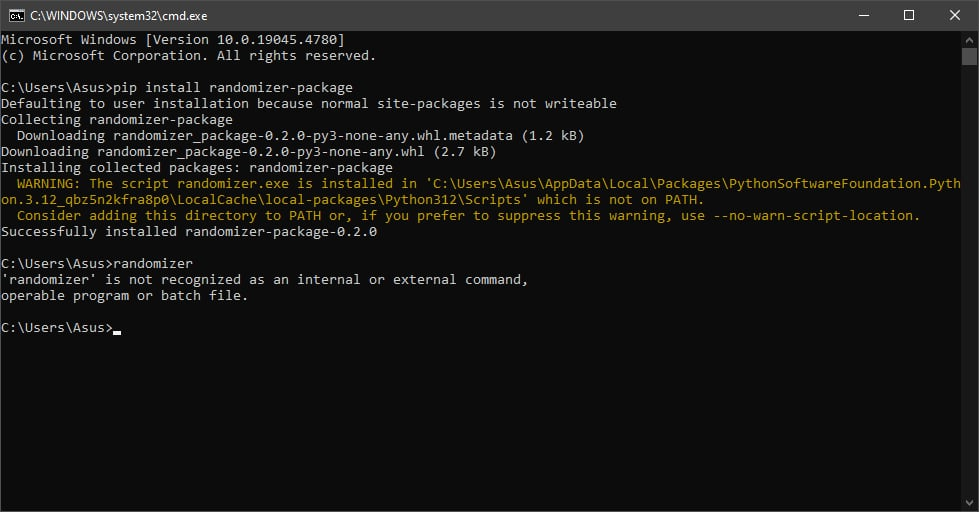
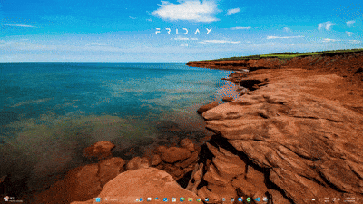

## Randomizer Application Documentation

### How to run the Randomizer Application
  #### 1. Go to [Randomizer Package Link](https://pypi.org/project/randomizer-package/0.4.0/#description)
  #### 2. Go to terminal and run this command.
    pip install randomizer-package==0.4.0
  #### 3. Check if the randomizer-package is in the pip list by using this command.
    pip list
  #### 4. If a warning shows up that looks like this
  
  #### 4.1 Copy the directory showed in the warning and paste it into the PATH in the environment variables.
  

  
